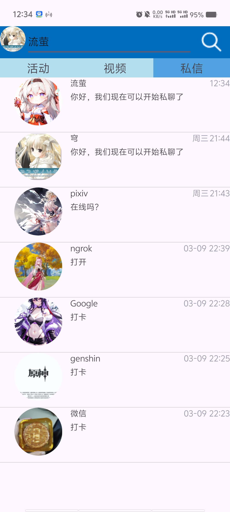

# AAW Android开发（服务器）

## 简介
在Android and Web(AAW)跨平台开发中，作为android端为用户提供服务，主要实现功能有：用户管理，分享视频，在线聊天，发布动态，浏览推荐内容

## 技术栈
android  
http 

## 展示
  
 
 
 

## 现状
目前备考，准备秋招，故部署项目  

（<del>目前大三下学期，在校辅修计算机，目前学校在学springboot，我在上学期已经学过了，但会为了跟老师的进度根据需求简单更新我库当中服务器项目，另外现在在备考研究生考试，时间不充裕，只有空余时间更新项目，在复习计算机基础知识时，会拿vue练手实践，所以会相对经常更新，而android项目目前没什么想做的，暂时不会做太大的更新。</del>）